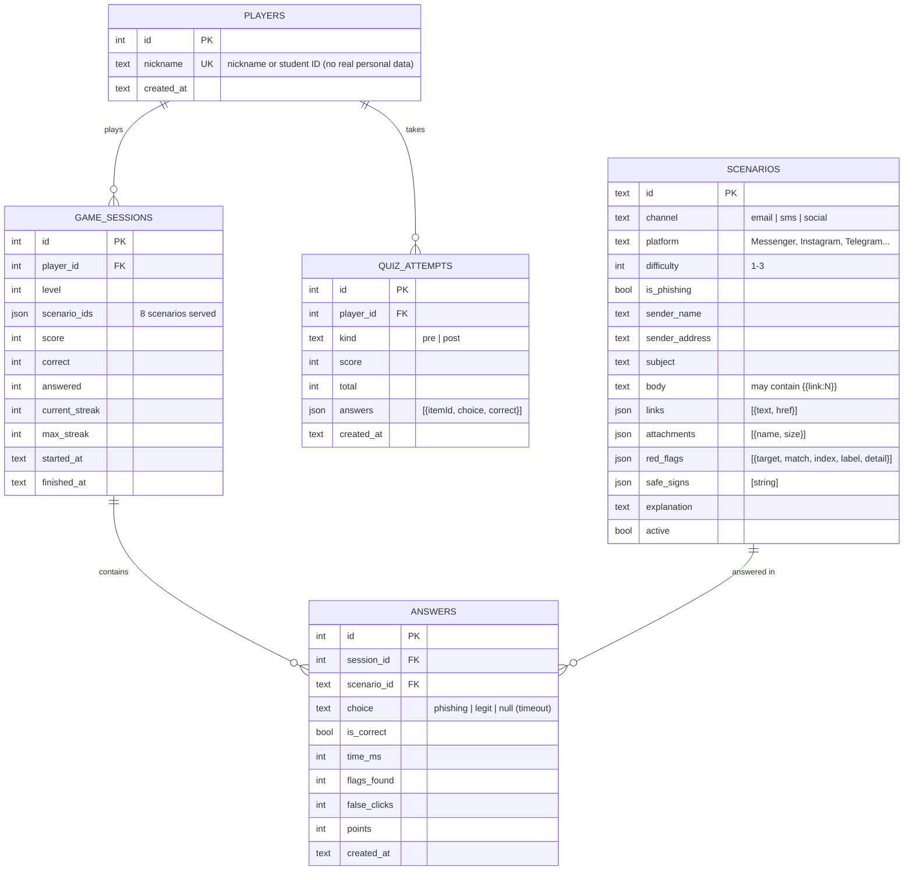

# Entity Relationship Diagram

```mermaid
erDiagram
  PLAYERS ||--o{ GAME_SESSIONS : plays
  PLAYERS ||--o{ QUIZ_ATTEMPTS : takes
  GAME_SESSIONS ||--o{ ANSWERS : contains
  SCENARIOS ||--o{ ANSWERS : "answered in"

  PLAYERS {
    int id PK
    text nickname UK "nickname or student ID (no real personal data)"
    text created_at
  }
  SCENARIOS {
    text id PK
    text channel "email | sms | social"
    text platform "Messenger, Instagram, Telegram..."
    int difficulty "1-3"
    bool is_phishing
    text sender_name
    text sender_address
    text subject
    text body "may contain {{link:N}}"
    json links "[{text, href}]"
    json attachments "[{name, size}]"
    json red_flags "[{target, match, index, label, detail}]"
    json safe_signs "[string]"
    text explanation
    bool active
  }
  GAME_SESSIONS {
    int id PK
    int player_id FK
    int level
    json scenario_ids "8 scenarios served"
    int score
    int correct
    int answered
    int current_streak
    int max_streak
    text started_at
    text finished_at
  }
  ANSWERS {
    int id PK
    int session_id FK
    text scenario_id FK
    text choice "phishing | legit | null (timeout)"
    bool is_correct
    int time_ms
    int flags_found
    int false_clicks
    int points
    text created_at
  }
  QUIZ_ATTEMPTS {
    int id PK
    int player_id FK
    text kind "pre | post"
    int score
    int total
    json answers "[{itemId, choice, correct}]"
    text created_at
  }
```

Quiz *items* (pre and post pools) are versioned in code (`server/src/data/quiz.js`) so both pools stay fixed for the whole study; only attempts are stored.
